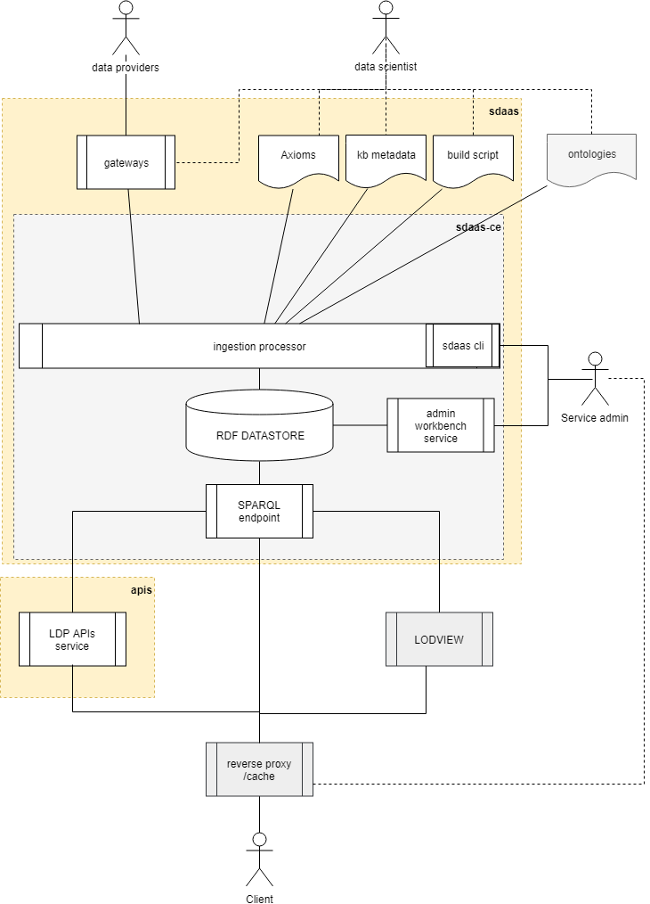
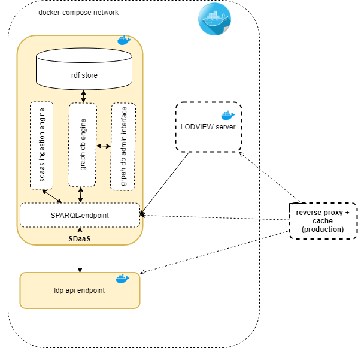

# g0v data-agicom

A *Smart Data Management Platform* to store information about
pluralism on television based on the data published by AGCOM (Agenzia per le garanzie nelle comunicazioni).

The knowledge base is compliant with RDF and Semantic Web Specification.

Applications can access the knowledge graph through a SPARQL interface.

**Reference implementations:**

- **SPARQL endpoint**: https://data.agcom.g0v.it/sparql
- **Linked Data browser**: http://data.agcom.g0v.it/welcome 
- **API endpoint**: https://data.agcom.g0v.it/ldp
- **Example of a data consumer**: https://agcom.g0v.it/

## Development

The project contains the two "core" logical components:

- **sdaas** (smart data as a service):  the data management platform core providing a RDF store, a [SPARQL endpoint](https://www.w3.org/TR/sparql11-overview), a data ingestion engine, a set of gateways to transform raw data in linked data and a build script that populates the RDF store. See files and docs in [sdaas directory](sdaas)
- a set of **apis** that query the SPARQL endpoint and produce json data with a schema suitable to be used with the BubbleGraph Component. See files and docs in [apis directory](apis)

Beside the core, two additional optional components may be needed to complete a real production system:

- **LODVIEW** server: a linked data web browser to deferencing URIS and navigate the Knowledge Graph;
- a **router** that provides a single access point to all services with firewall, caching and ssl features.

This picture shows the components interactions:



To deploy the platform, a stack of some services is required:



The platform is shipped with a [Docker](https://docker.com) setup that makes it easy 
to get a containerized development environment up and running. 
If you do not already have Docker on your computer, 
[it's the right time to install it](https://docs.docker.com/install/).

To start core services using [docker Compose](https://docs.docker.com/compose/) type: 

```
docker-compose build
docker-compose up -d
```

This starts locally the following services:


| Name        | Description                                                   | Port 
| ----------- | ------------------------------------------------------------- | ------- 
| sdaas       | a server that manages the datastore and the ingestion engine  | 29341    
| api         | a server that manages the web-budget api                      | 29342 

Try http://localhost:29341/sdaas to access blazegraph workbench
Try http://localhost:29342/ to test api endpoint

The first time you start the containers, Docker downloads and builds images for you. It will take some time, but don't worry
this is done only once. Starting servers will then be lightning fast.


To shudown the platform type: 

```
docker-compose down
```

## Support

For answers you may not find in here or in the Wiki, avoid posting issues. Feel free to ask for support on the [Slack](https://copernicani.slack.com/) general room. Make sure to mention **@enrico** so he is notified


## Credits

- the Smart Data Management Platform was developed by [LinkedData.Center](http://LinkedData.Center/)
- the ontologies and APIs was developed by Enrico Fagnoni @ LinkedData.Center
- raw data extracted from [AGICOM portal](https://www.agcom.it/) 
- the RDF datastore and the SPARQL endpoint is based on the [Blazegraph community edition](https://www.blazegraph.com/)
- The URI dereferencing platform is derived from the [LODView project](https://github.com/dvcama/LodView)

The on-line service and the reference implementation is hosted by the [Copernicani community](https://copernicani.it/).


## License

The MIT License (MIT). Please see [License File](LICENSE) for more information.
